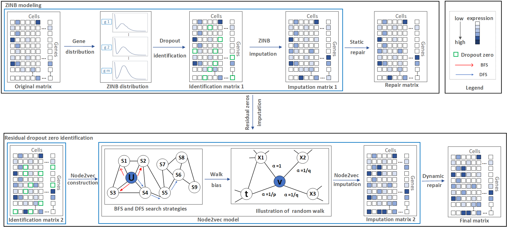

## PbImpute
### Overall architecture of the PbImpute algorithm pipeline:

## 1. Introduction

PbImpute: Precise Zero Discrimination and Balanced Imputation in Single-Cell RNA Sequencing Data

## 2. Run (Please place the entire project in `.../PbImpute/`)
For example:`D:/PbImpute`

### 2.1:&nbsp;&nbsp;Step 1: preprocessing (Please run `.../PbImpute/preprocessing/PbImpute.mlx`)

The first step is preprocessing. Please run the MATLAB file PbImpute.mlx, which contains detailed execution steps.
Please note that in the Ledein_SNN function, Rscript = 'D:\R\R-4.3.1\bin\Rscript.exe' specifies the path to your R installation. If the operation is successful, there will be a "grout.txt" file in the .../PbImpute/preprocessing/.

### 2.2:&nbsp;&nbsp;Step 2: ZINB imputation (Please run `.../PbImpute/ZINB_imputation/pbimpute1.R`)
The second step is  ZINB imputation, specifically including our a new ZINB model and static repair. 

### 2.3:&nbsp;&nbsp;Step 3: Residual imputation (Please run `.../Residual_imputation/test.py`)
The third  step is  Residual imputation, specifically including our a graphic embedding and dynamic repair.

## 3. Comparative Models
The following models and methods are referenced:
- **scImpute**: [Nature Communications](https://www.nature.com/articles/s41467-018-03405-7)
- **SAVER**: [Nature Methods](https://www.nature.com/articles/s41592-018-0033-z)
- **MAGIC**: [Cell](https://www.cell.com/cell/fulltext/S0092-8674(18)30724-4)
- **DCA**: [Nature Communications](https://www.nature.com/articles/s41467-018-07931-2)
- **DeepImpute**: [Genome Biology](https://link.springer.com/article/10.1186/s13059-019-1837-6)
- **bayNorm**: [Bioinformatics](https://academic.oup.com/bioinformatics/article/36/4/1174/5581401)
- **GE-Impute**: [Briefings in Bioinformatics](https://academic.oup.com/bib/article/23/5/bbac313/6651303?login=false)
- **ALRA**: [Nature Communications](https://www.nature.com/articles/s41467-021-27729-z)
- **CL-Impute**: [Computers in Biology and Medicine](https://www.sciencedirect.com/science/article/abs/pii/S001048252300728X)
- **TsImpute**: [Bioinformatics](https://academic.oup.com/bioinformatics/article/39/12/btad731/7457483)

## 4. Data availability
### 4.1 Real dataset
The datasets were derived from publicly available sources: 
- The PBMC datasets from [10x Genomics](https://support.10xgenomics.com/single-cell-gene-expression/datasets/2.1.0/pbmc4k),
- The worm neuron cells from [Cole Trapnell Lab](https://cole-trapnell-lab.github.io/worm-rna/docs/),
- The LPS datasets from [NCBI GEO](https://www.ncbi.nlm.nih.gov/geo/query/acc.cgi?acc=GSE17721),
- The mouse bladder cells from [Figshare](https://figshare.com/s/865e694ad06d5857db4b).
### 4.2 Simulate dataset
The simulated datasets come from: [SCRABBLE](https://link.springer.com/article/10.1186/s13059-019-1681-8) and [Splatter](https://link.springer.com/article/10.1186/s13059-017-1305-0).  
Since SCRABBLE is constrained by bulk RNA-seq data and introduces other datasets, we will not compare the SCRABBLE method here.
- **Dataset 1**, **Dataset 2**, **Dataset 3**:
  - Each dataset corresponds to dropout rates of 35%, 43%, 57%, 71%, and 83% dropout dataset.
  - Compute the average of the results with the same dropout rate.
- **Large Dataset**:
  - To test runtime and memory usage (from 10,000 cells to 50,000 cells)
  - To visualize clustering (40,000 cells)

`
library(edgeR)
library(Matrix)
library(splatter)
library(scater)
library(Seurat)
######## Data Generation ##############
# the function generating the simulation data using bioconductor package Splatter
generate_simulation_splatter <- function(dropout_index, seed_value, nGenes = 2000){
  # Parameter in the function
  # dropout_index: the index of dropout_mid to control the dropout rate
  #    seed_value: the random seed
  #        nGenes: the number of genes in the simulation data. 
  # Set up the parameters
  params = newSplatParams()
  params = setParams(params, list(batchCells = 3000,
                                  nGenes = nGenes,
                                  group.prob = c(0.20, 0.35, 0.45),
                                  de.prob = c(0.045, 0.045, 0.045),
                                  de.facLoc = 0.1,
                                  de.facScale = 0.4)
  )
  # Set up the vector of dropout.mid
  dropout_mid = c(0.1,1,2,3,4)
  # dropout_mid = c(3)
  # determine if it is a good parameter
  if(dropout_index > length(dropout_mid)){
    stop(
      paste0('The dropout_index shold not be greater than ', 
             length(dropout_mid), 
             ' . Please input a proper one.\n')
    )
    
  }
  
  # Generate the simulation data using Splatter package
  sim = splatSimulateGroups(params,
                            dropout.type = "experiment",
                            dropout.shape = -1,
                            dropout.mid = dropout_mid[dropout_index],
                            seed = seed_value)
  
  # genereate the cpm levels of the true simulation data
  # 
  
  data_true = (assay(sim, "TrueCounts"))
  data_dropout = data_true
  # generate the dropout data based on the counts in sim
  # generate the dropout data based on the counts in sim
  data_dropout[as.matrix(counts(sim)) == 0] = 0
  
  # calculate the dropout rate
  percentage_zeros = round(nnzero(data_dropout == 0, na.counted = NA)/
                             (dim(data_dropout)[1]*dim(data_dropout)[2])*100)
  
  
  # generate the bulk RNAseq data
  data_bulk = data.frame(val = rowMeans(data_true))
  
  # define the data list for the simulation data
  # indcluding: data_true: true data
  #          data_dropout: dropout data
  #             data_bluk: bulk data
  #      percentage_zeros: dropout rate
  #                 group: the group label
  
  data = list()
  
  data$data_bulk = data_bulk
  
  data$data_dropout = data_dropout
  
  data$data_true = data_true
  
  data$percentage_zeros = percentage_zeros
  
  data$group = colData(sim)@listData$Group
  
  return(data)
}

# generate the simulation data and save the data
generate_save_data <- function(dropout_index, seed_value){
  # Parameter in the function
  # dropout_index: the index of dropout_mid to control the dropout rate
  # seed_value: the random seed
  
  # generate the simulation data
  data_simulation = generate_simulation_splatter(dropout_index, seed_value)
  # generate the folder saving the simulation data

  # save the data as RDS format
  saveRDS(data_simulation, 
          file = paste0('simulation_data_dropout_index_',
                        dropout_index, 
                        '_seed_', 
                        seed_value,
                        '.rds')
  )
  
}

# the following script is to generate the simulation data. Here we use 
# HPC to generate the simulation which could reduce the running time
for (dropout_index in c(1,2,3,4,5)) {
  for (i in 1:3) {
    generate_save_data(dropout_index, 100)
}
}
`

